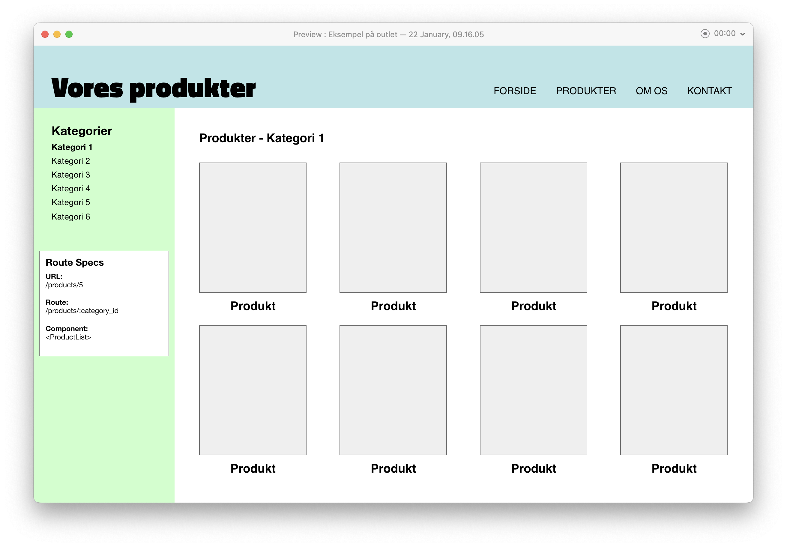
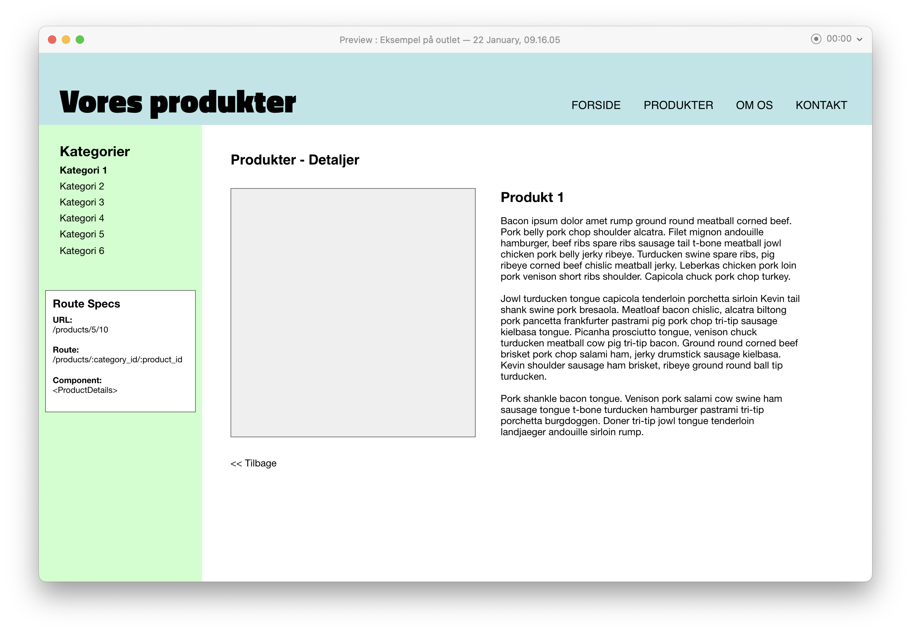

# React Router - Indlejrede routes (`<Outlet>`)

Routes kan være indlejret inde i hinanden, og deres stier vil dermed også været indlejret.

Det betyder at du kan allokere et område af din side til visning af forskelligt indhold alt efter hvilken url, der bliver kaldt.

## Case:
På følgende mockup skal main området veksle mellem nogle produktlister og produktdetaljer - alt efter hvilken url der bliver kaldt.

Produkt liste:


Produkt detaljer:


I venstremenuen er der angivet hvilken url, route og komponent de forskellige visninger skal kaldes med.

Vi kan styre dette via vores router ved at bruge indlejrede routes og react-router-dom metoden `<Outlet></Outlet>`.

### Opsætning af indlejrede routes
I vores router kode kan vi indlejre de forskellige visninger under den route der peget på `/products`:

```js
export const AppRouter = () => {
  return (
    <Routes>
      <Route index element={<Home />}>

      <Route path="/products" element={<ProductPage />}>
        <Route path=":category_id" element={<ProductList />}>
        <Route path=":category_id/:product_id" element={<ProductDetails />} />
      </Route>

    </Routes>
  )
}
```

### Forklaring:
1. Den overordnede route viser elementet `<ProductPage>` på url'en `/products`.
2. Den første indlejrede route viser elementet `<ProductPage>` på url'en `/products/category_id`. *Eksempel: /products/5*
3. Den anden indlejrede route viser elementet `<ProductDetails>` på url'en `/products/category_id/product_id`. *Eksempel: /products/5/10*
___
## Opsætning af sidekomponent
I vores side komponent (`<ProductPage>`) kan vi indsætte navigationen med kategorier og så metoden `<Outlet>` som vil renderer de indlejrede routes.

**Eksempel:**
```js 
import { Outlet } from 'react-router-dom'
import { CategoryNav } from './myapp/CategoryNav'

export const ProductPage = () => {
  return (
    <div>
      <nav id="leftnav">
        <CategoryNav />
      </nav>
      <main>
        <Outlet />
      </main>
    </div>
  )
}
```
I ovenstående kode vil `<Outlet>` komponentet nu vise enten en produktliste eller detaljer alt efter hvilken url der kaldes. 

Og da de begge er indlejret under routen til '/products' vil `<ProductPage>` komponentet altid vises på den url.

Overordnet set kan komponenter, der bruges højere i rutehierarkiet, altså bruge et `<Outlet>` element for at gengive deres underruter.
