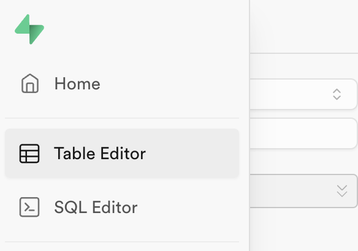

# Opret tabel
Følgende guide vil vise dig hvordan du kan oprette en tabel i Supabase.

1. Klik på ikonet *Table Editor* i ikonmenuen til venstre. Nu kommer der en ny menu frem i venstre side af skærmen hvor du kan se dine tabeller.

___
2. Klik på *Create a new table* i midterfeltet. 

___
3. Indtast navn og beskrivelse på din tabel. 

	> Det kan anbefales at du laver en regel - eller *naming convention* til dine tabeller. Eksempelvis: lowercased engelsk med underscores som seperator.
___
4. Indstil *Row Level Security*
	
	Row Level Security (RLS) i Supabase er en funktion, der giver dig mulighed for at styre adgangen til rækker (rows) i dine databasetabeller baseret på brugerens identitet og en række regler. 
	
	Du vil lære mere om RLS senere på dette kursus men indtil videre kan du lade den være slået fra.

___
**5.  Enable realtime**

Ved at slå denne til kan du sende ændringer i tabellen til udvalgte brugere. Lad den være slået fra.

___
**6. Colums**
	
Columns er felterne i vores tabel.

Supabase opretter nye tabeller med felterne *id* og *created_at* som standard. Id er den primære nøgle og created_at indikerer en rækkes oprettelsestidspunkt. 

Her kan du oprette de enkelte felter ved at klikke *Add Column*. 

I kolonneformularen kan du indstille feltets navn, datatype, standard værdi og om feltet skal være tabellens primære nøgle eller en fremmednøgle til en anden tabel.

Yderst til højre kan du slette feltet.

Hvis du vil ændre rækkefølgen af felter kan du trække i et felts venstre side og vælge den nye placering.  

Du kan også importere kommasepareret data fra en csv fil ved at klikke på knappen *Import data via spreadsheet*.
___
**7. Opret ny felt**

Klik på *Add Column* for at oprette et nyt felt. Indstil feltet efter hvad type det skal være.

Du kan se de forskellige datatyper på dette link: 
https://supabase.com/docs/guides/database/tables#data-types (Klik på pilen)

De mest brugte er *uuid*, *int4*, *int8*, *bool*, *varchar*, *text* og *timestamptz*

> NB. Det kan anbefales at  vælge typen *uuid* til primære nøgler som id felter, da den genererer en unik værdi.

___ 
**8. Gem din tabel**

Klik på *Save* knappen for at gemme. Nu kan du se din nye tabel i menuen til venstre.
___
**9. Tips!**

Du har en del muligheder i toppen af dit vindue. Her kan du blandt andet opdatere og filtrere dine tabeller. Du har også nem adgang til roller og api dokumentation.

Hvis du klikker på den lille pil ud for hver tabel i venstremenuen får du mulighed for at redigere, duplikere, eksportere og slette de enkelte tabeller.

Du kan også åbne din tabel i PostGres SQL ved at klikke på knappen *Definition*.

Hvis du vil redigere et enkelt felt kan du klikke på pilen ud for feltets navn. Der kan du også 
"fryse" en kolonne eller slettet den.

[Læs mere om supabase tables](https://supabase.com/docs/guides/database/tables)

## Supabase diagram
På ikonet *Database* i Supabases venstremenu kan du finde finde en visuel oversigt over dine tabeller under punktet *Schema Visualizer*

