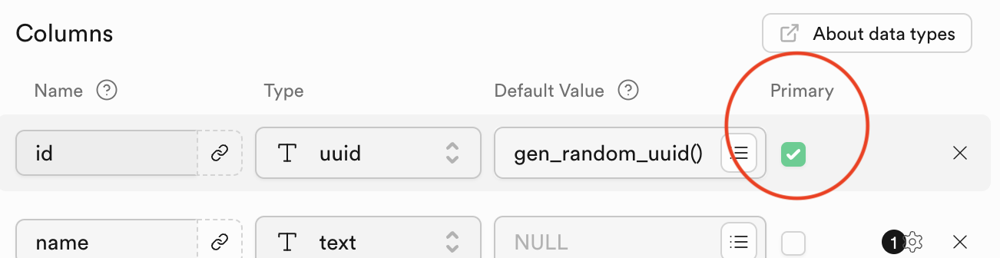

# CSV Import: Indstilling af datatyper
Selvom Supabases import funktion er mega smart skal vi som regel stadig lave nogle små tilrettelser i forhold til datatyper, primære nøgler og relationer.

For Supabase kan ikke altid lige spotte en data fra en CSV fil er en varchar, text eller et unikt id - og heller ikke om et felt er en primær nøgle eller relateret til en anden tabel.

Denne guide vil gennemgå de felter vi typisk skal efterbehandle når vi har oprettet en tabel ud fra en CSV import.

I alle tilfælde skal du vælge *Edit table* ud for en tabel i tabellisten til venstre når du vil redigere en tabel og dennes felter.

> 
___
## Identifiers
Feltet *id* kaldes en *identifier* da den bruges til at identificere de enkelte rækker med. Den skal altid markeres som tabellens primære nøgle og dette gøres ved at sætte kryds i checkboxen ud for feltet.

> 

Desuden skal id feltet sættes til datatypen *uuid*. Det står for *Universally Unique Identifier* og kan med fordel bruges til unikke værdier. Man kan samtidig vælge *gen_random_uuid()* under *Default Value* og dermed sørge for at der automatisk genereres et unikt id når der oprettes en ny record i tabellen.

> 
___
## Tekstfelter
Når du arbejder med PostgreSQL som Supabase er bygget på, er det generelt en bedre praksis at bruge datatypen *text* istedet for *varchar*. Det skyldes at typen *varchar* kan give unødvendige problemer for længden af dine tekster. 

I øvrigt er typen *text* i realiteten den samme som varchar uden længdebegrænsning i PostgreSQL. Begge typer håndteres effektivt og er designet til at håndtere store mængder tekstdata. Ved at bruge text kan du undgå forvirring og forenkle dit database design.

