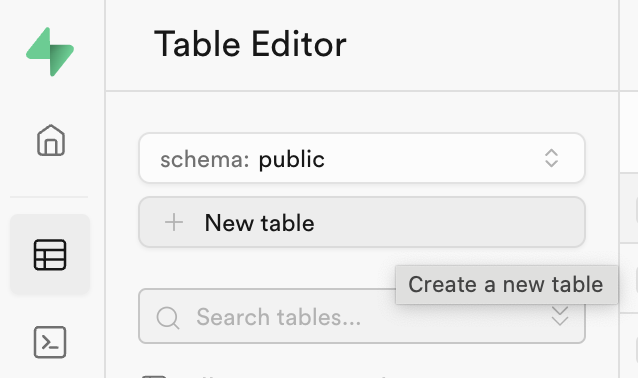
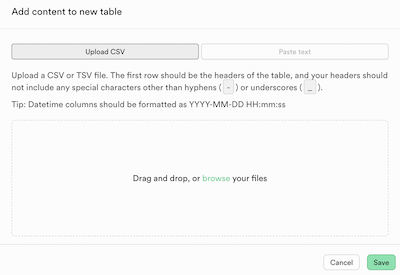

# Import af CSV data med oprettelse af tabel
Følgende guide vil demonstrere hvordan du kan Supabase oprette en tabel når du importerer CSV data.

Guidens eksempel tager udgangspunkt i nedenstående CSV data.

> NB! Denne guide tager ikke højde for relationelle data.

**CSV struktur**
```csv
name,email
Lise,lise@gmail.com
Niklas,niklas@live.dk
Benny,benny@webudvikler.dk
```
___
## Guide

### 1. Klik på knappen *New table*.

> 
___
### 2. Klik på *Import data via spreadsheet* længere nede.
> 
___
### 3. Vælg om du vil uploade en csv fil eller indsætte en csv tekst.
> 
	
	Når du har gjort det vil Supabase evaluere dine data og give dig besked hvis der er fejl i dem. Forsøg at løse fejl hvis der er nogle.

	> Tip: Det kan være noget hurtigere at indsætte CSV tekst direkte i formularen.
___
### 4. Tjek dine data
	
	Hvis alt er gået godt skulle du nu gerne kunne se dine data i tabellen.
___
### 5. Indsæt id
Efterfølgende kan du tilfølje id og andre felter til din tabel. Husk at gøre det med default values - så opdaterer Supabase automatisk værdierne når du gemmer.

Husk også at angive id som primary key på dine tabeller.

Du kan få inspiration af nedenstående model:

| Felt       | Type        | Default value        | Primær nøgle |
|------------|-------------|----------------------|--------------|
| id         | uuid        | gen_random_uuid()    | X         |
| created_at | timestamptz | now()                |         |
___

