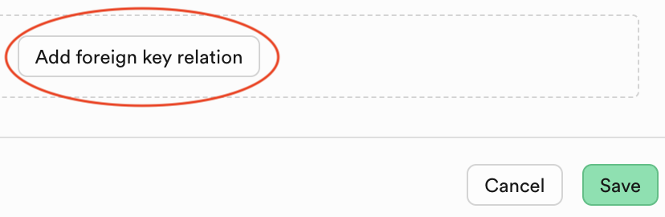
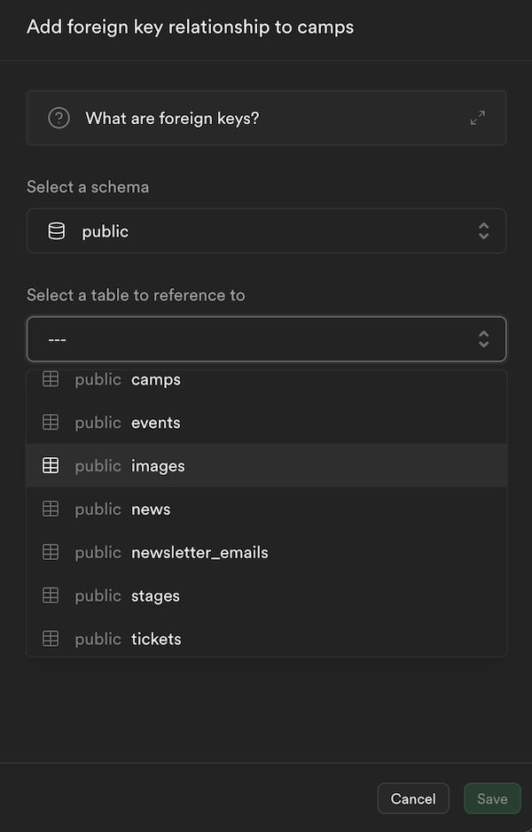
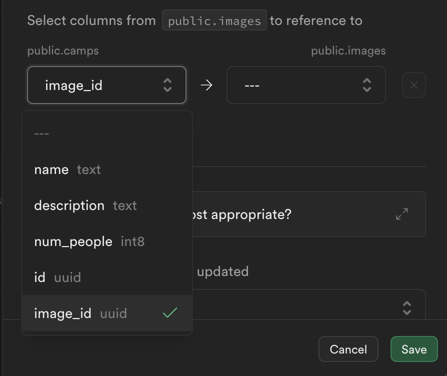
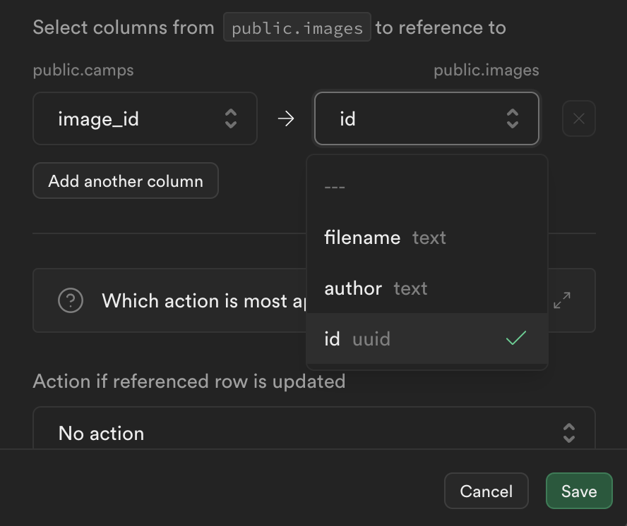
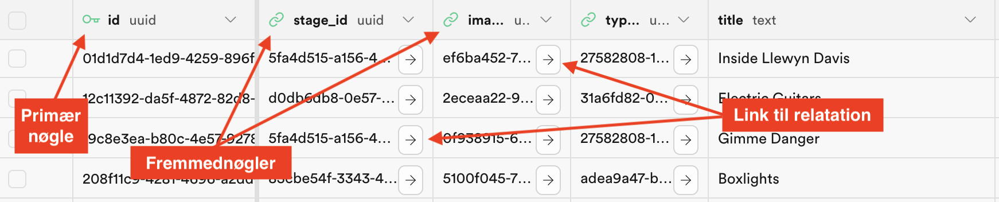

# CSV Import: Indstilling af fremmednøgler
Fremmednøgler skal gerne refere til et felt i en anden tabel og er grundstenen i den relationelle database. Du kan altid kende fremmednøgler på deres navn som består af tabellens navn og felt - hvilket typisk er feltet *id*:

**Syntaks på en fremmednøgle (Foreing key):**
```
tablename_tablefield
```
Nednestående nøgle skal således referere til feltet *id* i tabellen *image*:
```
image_id
```
Hvis du vil have den fulde effekt af fremmednøgler skal du manuelt ind og sætte dem i Supabase. Følgende guide viser hvordan du kan gøre dette.
___
### 1. Tilføj fremmednøgle (Foreign key)
Klik på knappen *Add foreign key relation* i bunden af en tabels redigeringspanel:

> 
___
### 2. Vælg relationstabel
Vælg den tabel du vil lave relationen til. Hvis din fremmednøgle eksempelvis hedder *image_id* skal du vælge tabellen *images*.

> 

> Læg mærke til at du kan læse mere om relationer i supabase på linket over dropdown boksen.
___
### 3. Vælg fremmednøgle i aktuel tabel
I den venstre dropdown skal du nu vælge det felt der skal være fremmednøgle i din aktuelle tabel. Altså *image_id* i vores eksempel.

> 
___
### 4. Vælg felt i fremmedtabel
I den højre dropdown skal du derefter vælge det felt der skal relateres til i den fremmede tabel . Altså id i vores eksempel.

> 
___
### 5. Handling (Actions)
Her kan du vælge hvad der skal ske med relationer når en record opdateres eller slettes. 

I vores eksempel giver det bedst mening at vælge hvad der skal ske hvis vores billede bliver slettet. Her skal du først vurdere om et emne (event, user, post) kan eksistere uden relationen. 

Derefter kan du vælge en af følgende:

- **Cascade**
	
	Cascade sletter eller opdaterer automatisk rækker i relaterede tabeller.
	
	*Eksempel:*

	Hvis vi sletter en række i tabellen `camps`, vil relaterede billeder også blive slettet i tabellen `images`.

- **Restrict/No action**

	Restrict forhindrer sletning eller opdatering af en række i den refererede tabel, hvis der stadig findes relaterede rækker i den refererende tabel.

	Med metoden *No action* er det op til databasen eller brugeren at håndtere hvad der skal ske med relationen.

	*Eksempel:*

	Du kan ikke slette records i `camps`, hvis der stadig er relationer til `images`.

- **Set NULL / Set default**
	Hvis en relation er valgfri sættes fremmednøglefeltet til `NULL` eller *default value*.

	*Eksempel:*

	Feltet `image_id` i *camps* sættes til `NULL` hvis det relaterede billede slettes.

De mest anvendte metoder er *restrict* og *cascade*. Standard metoden er *No action*.	

Du kan undlade at vælge en metode.
___
### 6. Gem dine ændringer
Klik på Save for at gemme.

Hvis du får en fejl skal du huske at tjekke at de relaterede felter har samme datatype.
___
### 7. Tjek dine ændringer

Hvis du går til oversigten over din tabel, skulle du nu gerne kunne se en markering af din nye relation i den øverste række. Her kan du også se en markering af den primære nøgle og de enkelte felters datatype.

> 
___


