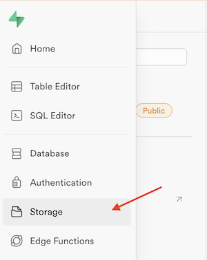

# Supabase Storage 
Følgende guide vil vise dig hvordan du kan uploade og hente dine billeder og filer til Supabase Storage.
___
### 1. Gå til Supabase Storage
Klik på venstremenuen i din Supabase applikation og vælg *Storage*.

> 
___
### 2. Opret en bucket
En bucket i Supabase fungerer som en container for dine filer, hvilket gør det nemt at organisere og administrere dine fildata.  

Du kan passende oprette en *images* bucket til dine billeder.

Klik på knappen *New bucket*

> 
___
### 3. Indtast navn og gem
Skriv navnet på din bucket i input feltet. Du kan også vælge om din bucket skal være offentlig tilgængelig hvilket du skal gøre i dette tilfælde. 

Klik *Save* når du er færdig.

> 

Du kan nu se din nye bucket i listen til venstre.

Klik på pilen ud for navnet hvis du vil redigere.

> 

Supabase vil nu gemme og åbne din bucket i et adminpanel hvor du har mulighed for at oprette foldere og uploade filer. 
___
### 4. Opret folder
Du kan organisere dine filer i mapper i din bucket. Klik på knappen *Create folder* for at oprette en mappe.

> 

Når du har gemt kommer der et panel til venstre med dine foldere. I toppen kan du se hvilken folder du står i.

Klik på pilen i toppen for at komme tilbage til roden af din bucket.

> 
___
### 5. Upload filer
For at uploade dine filer kan du enten trække dem til *drop files* symbolet:

> 

Eller klikke på *Upload files* knappen i baren foroven og vælge de ønskede filer i dit filsystem:

> 
___
### 6. Tjek dine filer
Du vil nu se dine filer i en liste i dit bucket panel. Du kan se detaljer om en fil ved at klikke på den.

> 

Du kan klikke på de tre prikker ud for filen og at få en URL til filen, downloade, redigere eller slette filen.

> 
___
### 7. Adgang til filer i Storage
Alle har nu adgang til dine filer eftersom at din bucket er sat til at være *Public*.

Du kan bruge nedenstående url til at hente filer med offentlig adgang:
```
https://[project_id].supabase.co/storage/v1/object/public/[bucket]/[file-name]
```
Husk at skifte de firkantede paranteser ud med oplysninger fra dit eget supabase projekt.
___
