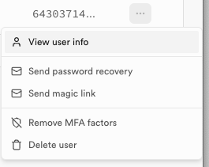

# Opret bruger
Denne guide vil vise dig hvordan du opretter en bruger i Supabase.
___
### 1. Gå til Supabase Authentication 
Klik på venstremenuen i din Supabase applikation og vælg *Authentication*.
> 
___
### 2. Klik på *Add User* og vælg *Create new user*
LÆg mærke til at du også kan sende en invitation til en brugers email.
> 
___
### 3. Udfyld felter
Indtast email og password på den bruger du vil oprette. Sæt kryds i *Auto Confirm User* for at bekræfte oprettelsen med det samme. Klik på *Create User* for at oprette.
> 

Nu skulle du gerne kunne se din bruger på listen.
> 

___
### 5. Rediger bruger
Klik på de tre prikker (...) ud for en bruger hvis du vil redigere, skifte password eller slette brugeren.
> 

Du kan også sende et *Magic Link* som er et link der giver en tidsbegrænset adgang for brugere uden at de skal huske deres password.

