# Trinvis guide til en git branching model
Dette projekt indeholder trin-for-trin-instruktioner til at arbejde med Git samt GitHub Projects og Issues.

Dette er ikke en guide til at lære Git. Det er en guide til at bruge Git på en bestemt måde ved hjælp af GitHub Issues og Projects.

## Forudsætninger for denne guide
Du skal have et grundlæggende kendskab til Git.

Du skal have et fungerende arbejdsmiljø med:

- VS Code: https://code.visualstudio.com/download
- Git installation: https://git-scm.com/downloads.
- En konto på github: https://github.com/


## Første trin, som kun udføres én gang i starten af et projekt

### 1. Log ind med din GitHub-konto og opret et nyt repository.


### 2. Tilføj samarbejdspartnere til repository:


### 3. Opret et GitHub-projekt
Klik på fanen **Projects**, og opret derefter et nyt projekt på GitHub.


Brug Kanban-skabelonen:

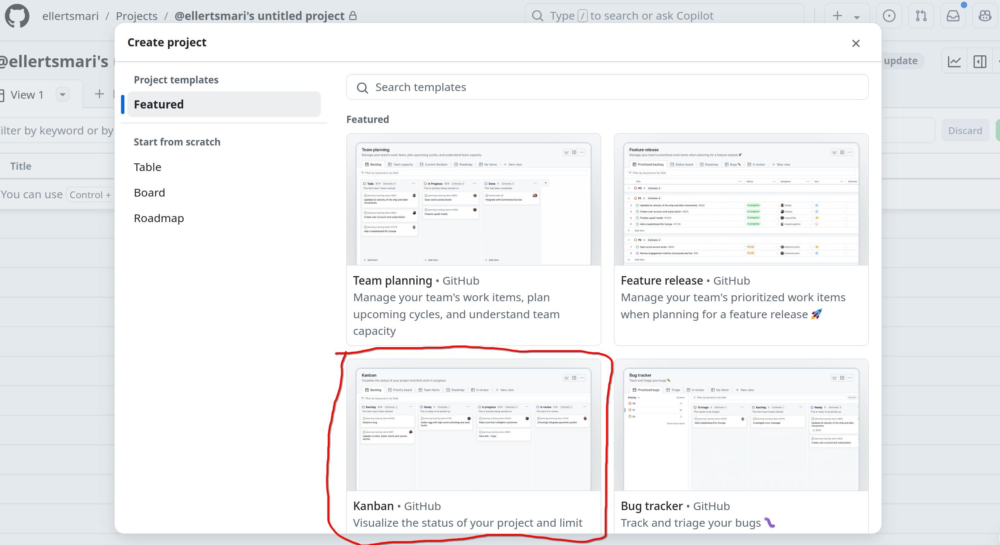

Dit projekt bør nu se nogenlunde sådan her ud:


### 4. Opret **main**- og **develop**-branches lokalt og push dit første commit.

Opret et nyt lokalt projekt i Visual Studio Code i en ny mappe. Opret derefter nogle filer (fx din `README.md`-fil), og kør følgende Git-kommandoer:

```
git init
git add .
git commit -m "first commit"
git remote add origin <<your github's repository url>>

git branch -M develop
git push origin develop

git branch main
git push origin main
```
> Husk at udskife *<<your github's repository url>>* med url'en til dit repository.

### 5. Opret GitHub-regler for **main**- og **develop**-branchene.
Klik på fanen **Settings**, og vælg derefter **Add classic branch protection**.


Opret derefter regler for **main**- og **develop**-branchene på GitHub.

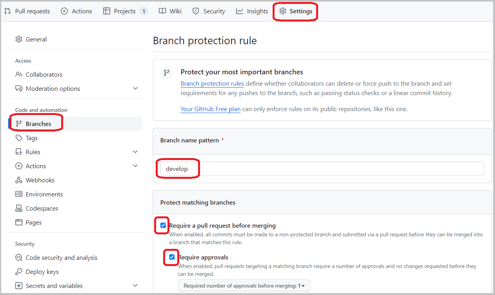

### 6. Start af et lokalt projekt i Visual Studio Code
Opret de filer, du har brug for til dit projekt (fx `index.html`, `styles.css`, `main.js` osv.), eller brug en starterpakke som **Vite** eller **create-next-app**.

## Trin som gentages gennem hele projektet

### 7. Tilføj items til backlog
I dit GitHub-projekt skal du oprette et nyt item i **Backlog**-kolonnen. I denne kolonne opretter du alle projektets opgaver.


Når dit item er oprettet i Backlog-kolonnen skal det gerne se ud som nedenstående:

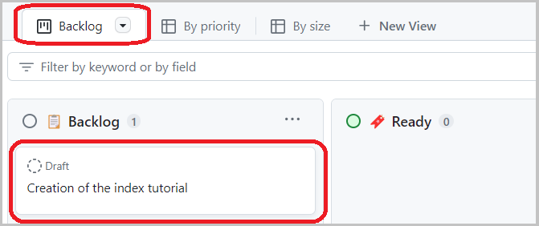

## Trin under planlægning af sprint (Ready, To Do)

### 8. Træk items til Ready-kolonnen
I begyndelsen af et nyt sprint skal du trække de items, du vil arbejde på i løbet af sprintet, over i **Ready**-kolonnen:

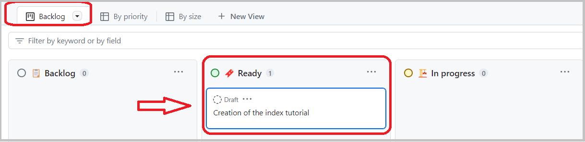

### 9. Konverter items til issues
Nu kan du konvertere dit item til et issue for at få et issue-nummer. Klik på de tre prikker for at gøre dette:

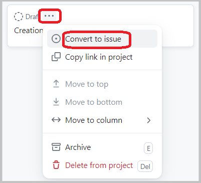

Nu vil dit item blive markeret med et issue ikon og få tildelt et nummer - i dette eksempel *#1*

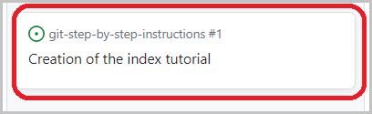

### 10. Tilknyt issue til repository
Klik på dit issue for at tilknytte et repository:

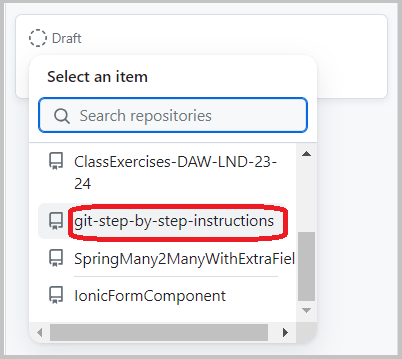

### 11. Tildel issue til udvikler
Klik på issue-titlen, og du vil få følgende vindue, hvor du kan tilføje en **assignee**, som skal arbejde på det pågældende issue:

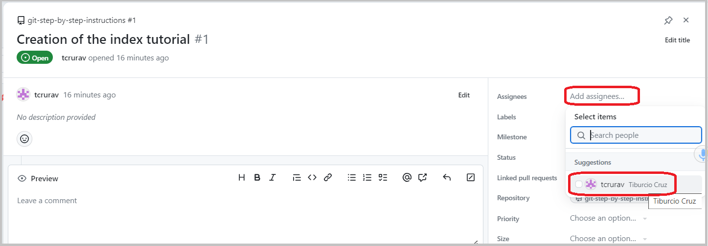

## Trin under udvikling af et issue (**In progress**)

### 12. Træk items til **In progress**-kolonnen
Nu kan du se dit issue med nummer, det tilknyttede repository samt den udvikler, der er tildelt.

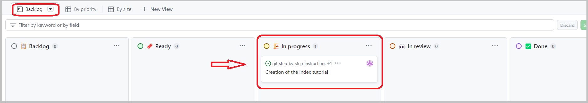

### 13. Opret ny lokal branch fra **develop** med navnet **issue#n**
I Visual Studio Code skal du nu oprette en ny branch ud fra **develop** med navnet **issue#1**, hvor **1** er nummeret på det issue du vil arbejde på.

Men først skal du sikre dig, at du befinder dig på **develop**-branchen.

Skriv følgende kommando i din VS Code terminal:
```
git branch
```
Hvis ikke, så skift til develop-branchen:
```
git checkout develop
```
Træk nu alle eventuelle ændringer fra den eksterne **develop**-branch ned lokalt med en *pull* kommando:
```
git pull origin develop
```
Opret nu en ny branch med navnet **issue#1**, hvor **1** er nummeret på dit issue:
```
git checkout -b issue#1
```
### 14. Arbejde på **issue#n**
I dette trin arbejder du på dit issue. Skriv eventuelt noget i din README fil.

### 15. Add, commit og push til den eksterne branch **issue#n**
Når du er færdig med koden til issuet, skal du pushe dine ændringer til den eksterne branch. Sørg for, at du befinder dig i projektets rodmappe. Vær også opmærksom på beskedformatet, hvor du skal inkludere nummeret på det issue, du arbejder på:
```
git add .
git commit -m "issue#1 - FIX some text in README file"
git push origin issue#1
```
### 16. Opret pull request for **issue#1**
I dit GitHub-repository kan du nu se følgende:

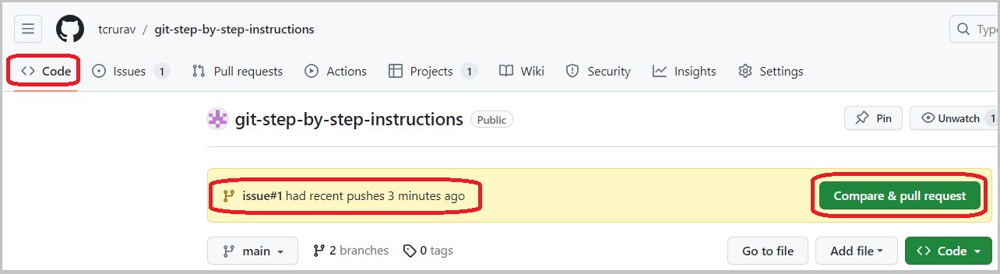

Når du klikker på den grønne **“Compare & pull request”**-knap, får du dette nye vindue, hvor du skal indtaste oplysningerne til dit pull request og klikke på **“Create pull request”**.


## Trin i GitHub til at gennemgå en pull request (**Review**)

### 17. Gennemgang af pull request for **issue#1**
Når du i det forrige trin har oprettet pull requesten, får du dette vindue, hvor du kan se, at **revieweren ikke bør være den samme person, som har pushet issuet**.

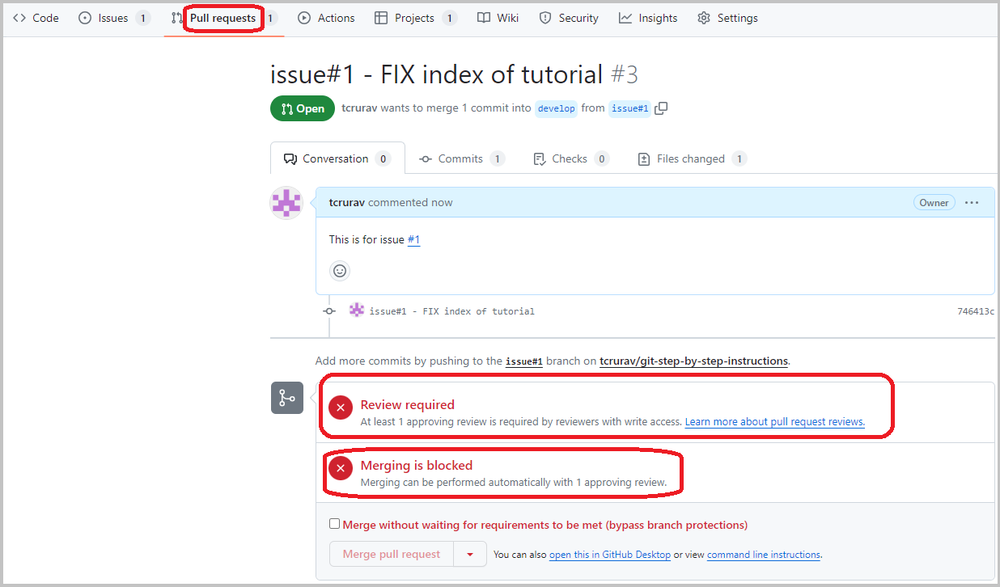

En anden udvikler, som fungerer som reviewer, skal gennemgå koden ved at klikke på **“Add your review”**-knappen. Vær opmærksom på, at reviewet skal ske fra **issue#1** til **develop**.


I det følgende vindue kan du godkende eller anmode om ændringer samt kommentere den kode, der er lavet i issuet.


## Trin i GitHub til at merge (**Done**)

### 18. Merging til **develop** fra **issue#1**
Når du i det forrige trin har godkendt dit review, kan du nu merge fra **issue#1** til **develop**.


### 19. Samme trin som **16 til 18**, men nu for at merge fra **develop** til **main**.
Når dit team beslutter det, kan I merge fra **develop** til **main**. For at gøre dette skal I blot gentage **trin 16 til 18**, men denne gang med den forskel, at revieweren merger fra **develop** til **main**.

> **I kan med fordel bruge *Milestones* til at definere hvornår der skal merges til main.**

## Ressourcer
* En meget komplet skabelon til **README.md**-filer<br />
[https://gist.github.com/PurpleBooth/109311bb0361f32d87a2](https://gist.github.com/PurpleBooth/109311bb0361f32d87a2)


* En specifikation for at tilføje både menneske- og maskinlæsbar betydning til commit-beskeder<br />
[https://www.conventionalcommits.org/en/v1.0.0/](https://www.conventionalcommits.org/en/v1.0.0/)

* En succesfuld Git-branchingmodel<br />
[https://nvie.com/posts/a-successful-git-branching-model/](https://nvie.com/posts/a-successful-git-branching-model/)


