# Git step by step instructions

This project includes step by step instructions to work with git, and github projects and issues as part of RiddleHunt Project in march 2024.

This is not a guide to learn git. This is a guide to use git in a certain way, using github issues and projects.


## Prerequisites

You need basic git background.

You need a working environment with:
* [Git](https://git-scm.com) - You can install it from https://git-scm.com/downloads.

## The steps of this step-by-step short guide (in just one image)

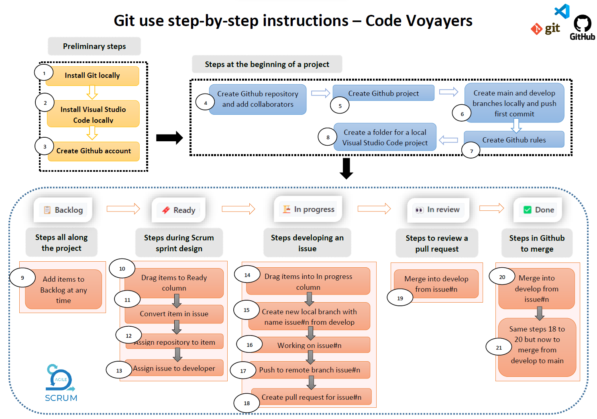

[Download this image as PDF file](docs/20231122-Git-Step-By-Step.pdf)

## The steps of this step-by-step short guide

This short guide is divided into:
* Preliminary steps
  - Step 1: Installing Git locally.
  - Step 2: Installing Visual Studio Code locally.
  - Step 3: Creating a Github account.
* First steps done only once at the beginning of a project
  - Step 4: Creating a Github repository and adding collaborators.
  - Step 5: Creating a Github project.
  - Step 6: Creating main and develop branches locally and push your first commit.
  - Step 7: Creating Github rules for main branch and develop branch.
  - Step 8: Creating a local project in Visual Studio Code.
* Steps all along the project (Backlog)
  - Step 9: Adding items to the backlog at anytime.
* Steps during Scrum sprint design (Ready)
  - Step 10: Dragging items to the Ready column.
  - Step 11: Converting items in issues.
  - Step 12: Assigning repository to the issue.
  - Step 13: Assigning issues to developers.
* Steps developing an issue (In progress)
  - Step 14: Dragging items to the In-progress column.
  - Step 15: Creating a new branch locally from develop with name issue#n
  - Step 16: working on the issue#n.
  - Step 17: git add, commit and push to remote branch issue#n
  - Step 18: Creating pull request for issue#1
* Steps in Github to Review a pull request (Review)
  - Step 19: Reviewing pull request for issue#1
* Steps in Github to merge (Done)
  - Step 20: Merging into develop from issue#1
  - Step 21: Same steps 18 to 20 but now to merge from develop to main

In the next sections we will see all this steps a bit deeper.


### Preliminary steps

In the preliminary steps you just have to start working with git following this steps:

* **Step 1: Installing Git locally.**

Just go to https://git-scm.com/downloads and then download Git for your favourite operating system; finally install git in your computer.


* **Step 2: Installing Visual Studio Code locally.**

Just go to https://code.visualstudio.com/ and then download Visual Studio Code for your favourite operating system; finally install git in your computer.


* **Step 3: Creating a Github account.**

Just go to https://github.com/ and then create your Github account.


### First steps done only once at the beginning of a project

In the preliminary steps you just have to start working with git following this steps:

* **Step 4: Creating a Github repository and adding collaborators.**

Log in with your Github account and create a new repository.

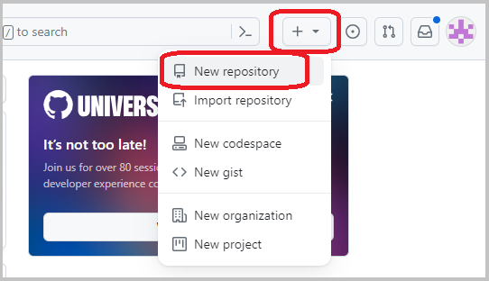

Add the collaborators to the repository:

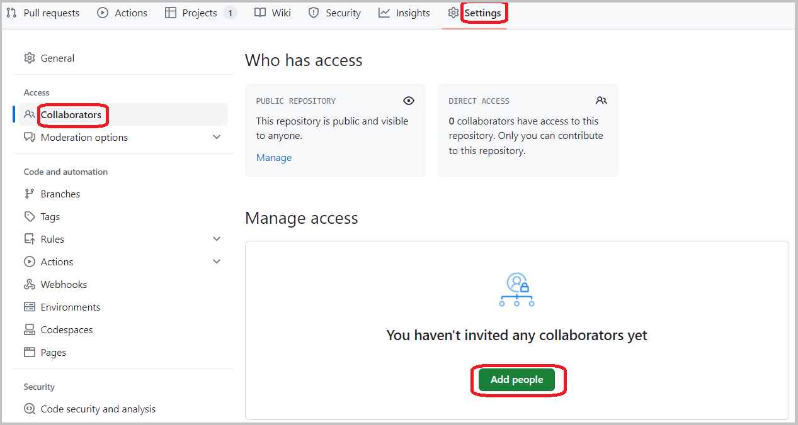


* **Step 5: Creating a Github project.**

Clic on the tab ```Projects``` and then create a new Project in Github.

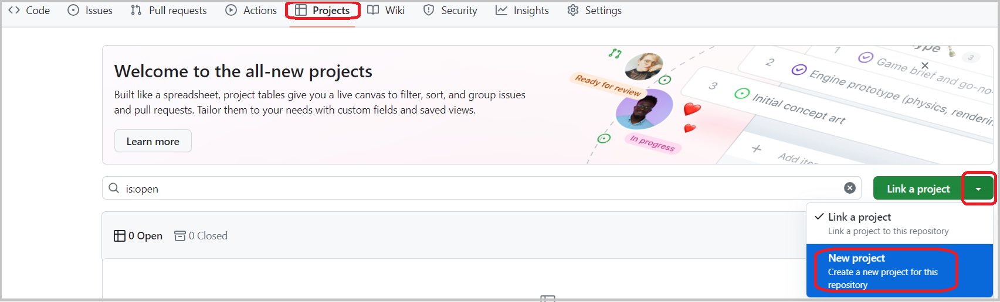

Now you can create the project:


Use the ```Team Backlog``` template:

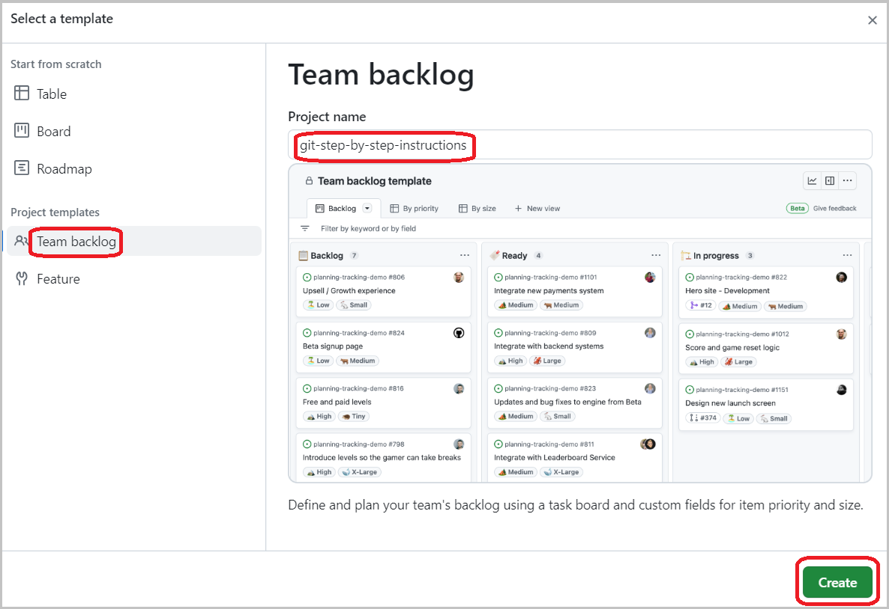

We will work with this 5 columns. Please remove the default left most one:

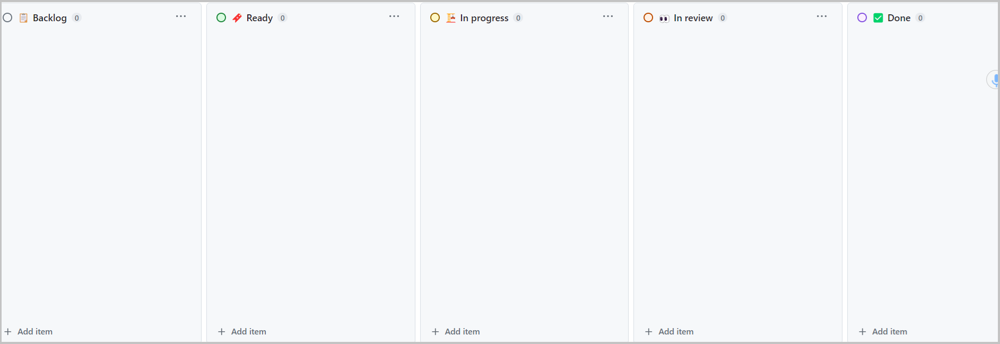

We will work with the following board columns, so that please delete the first default one:


* **Step 6: Creating main and develop branches locally and push your first commit.**

Just create a new local project in Visual Studio Code in a new folder. After that create some files (maybe your README.md file), and introduce the following git commands:

```
git init
git add .
git commit -m "first commit"
git remote add origin <<your github's repository url>>

git branch -M develop
git push origin develop

git branch main
git push origin main

```

* **Step 7: Creating Github rules for main branch and develop branch.**

Clic on the tab ```Settings``` and then create rules for main and develop branches in Github.


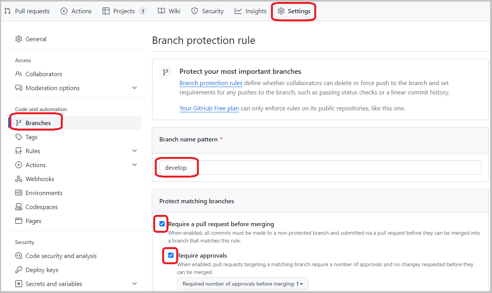

* **Step 8: Creating a local project in Visual Studio Code.**

Just create a new local project in Visual Studio Code in a new folder.


### Steps all along the project (Backlog)

* **Step 9: Adding items to the backlog at anytime.**

In your Github project create a new Item in the Backlog column. In this column you will be creating all project tasks:

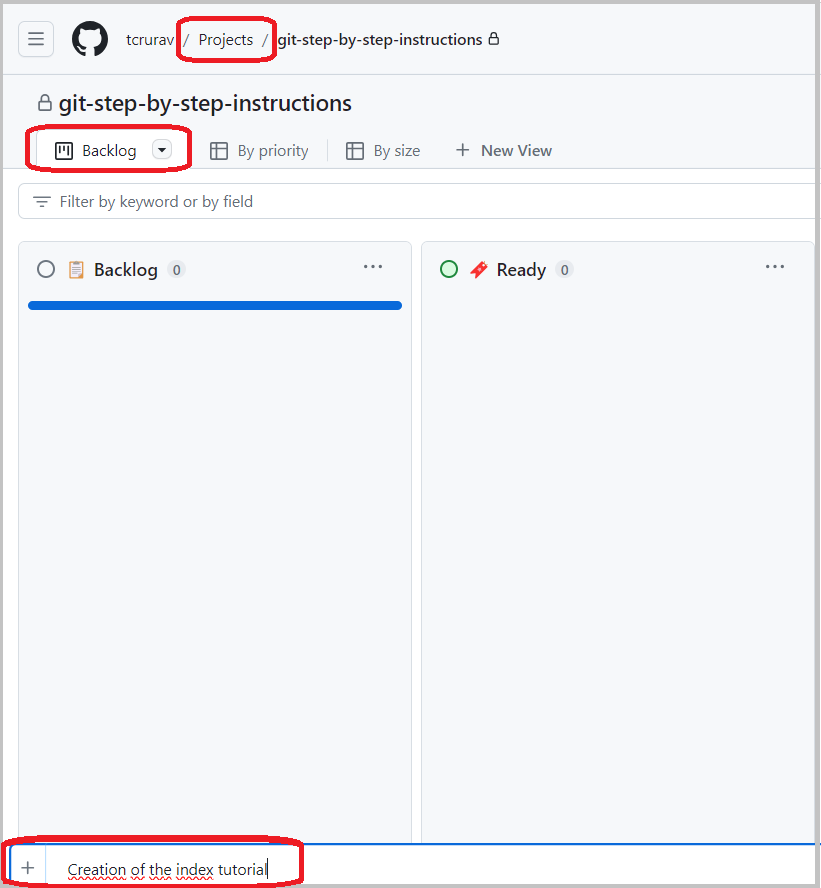

Now the item has been created in the Backlog column:

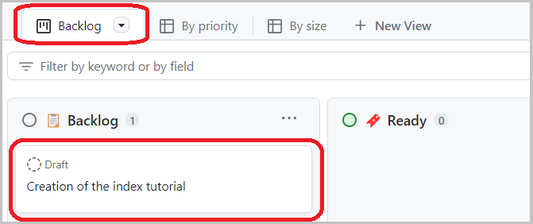


### Steps during Scrum sprint design (Ready)

* **Step 10: Dragging items to the Ready column.**

At the beginning of a new scrum sprint you have to drag the items you are going to work on during the sprint to the Ready column:

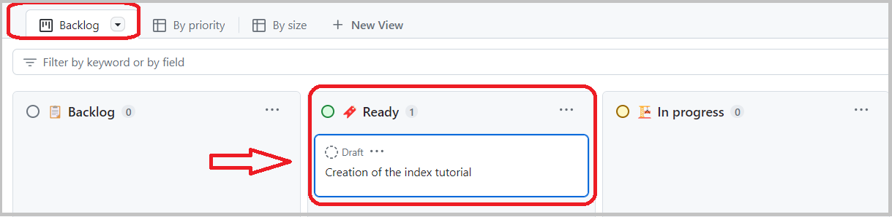


* **Step 11: Converting items in issues.**

Now we will convert the item in an issue to get an issue number. Click on the 3 dots for that:


Here you can see the assigned number for the issue is #1, and the icon shows that now is an issue and not an item any longer.

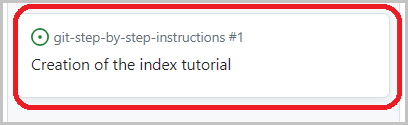


* **Step 12: Assigning repository to the issue.**

Clic on the issue to assign a respository to the issue:

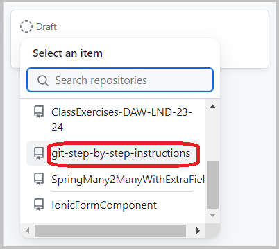


* **Step 13: Assigning issues to developers.**

Clic on the issue title and you will get the following window where you can add an assignee who will work on the issue:

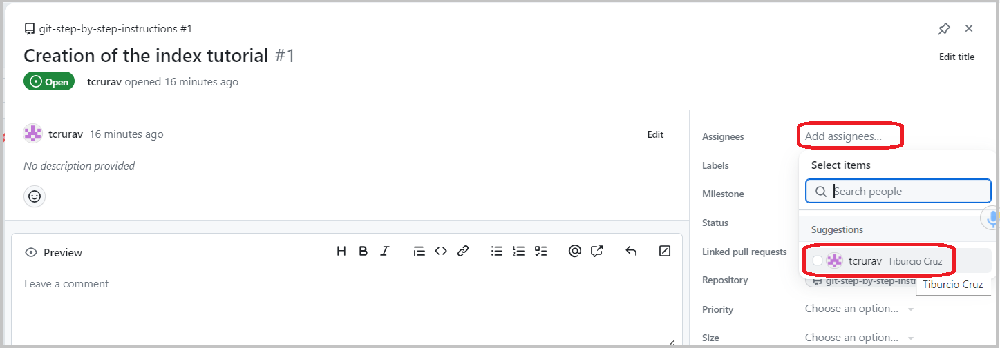


### Steps developing an issue (In progress)

* **Step 14: Dragging items to the In-progress column.**

Here you can now see the issue with its number, its respository assigned, as well as the developer assigned:

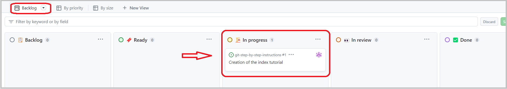


* **Step 15: Creating a new branch locally from develop with name issue#n**

In Visual Studio Code create from develop a new branch called issue#1, where 1 is the number of the corresponding issue.

But first be sure you are in branch develop

```
git branch
```

If not then go to develop branch:

```
git checkout develop
```

Now pull to local all possible changes in remote develop:

```
git pull origin develop
```

Now create a new branch called issue#1, where 1 is the number of the issue:

```
git branch issue#1
```

And finally put the Head on issue#1

```
git checkout issue#1
```


* **Step 16: working on the issue#n.**

In this step you are just working on the issue.


* **Step 17: git add, commit and push to remote branch issue#n**

When you are finished with the code of the issue, you have to push your changes to the remote branch. Be sure you are on your project root directory. And pay attention to the message format where you should include the issue number you are working on:

```
git add .
git commit -m "issue#1 - FIX some text"
git push origin issue#1
```

* **Step 18: Creating pull request for issue#1**

In your Github repository you can now see the following:

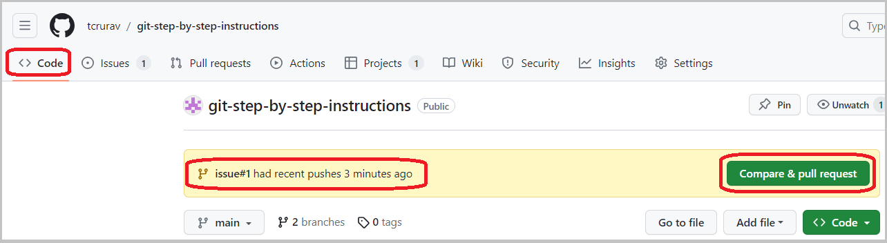

Clicking on the "compare & pull request" green button you will get this new window, where you will enter the data for the pull request and clic on "create pull request":

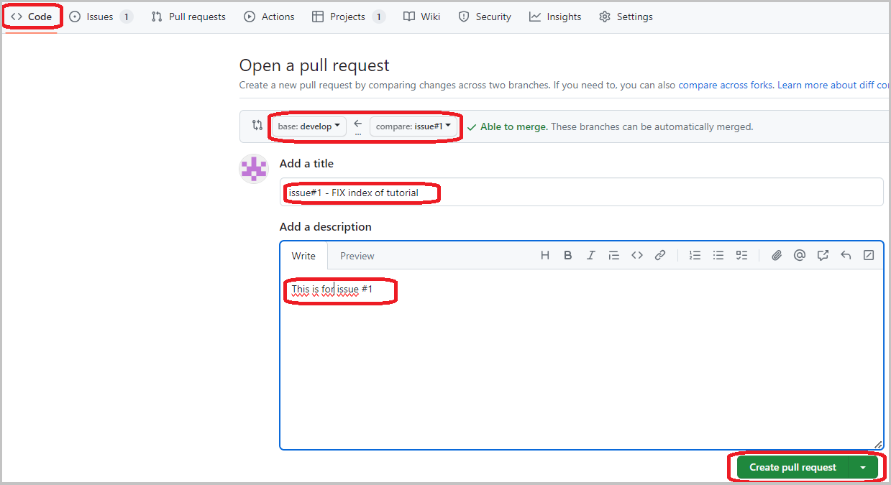


### Steps in Github to Review a pull request (Review)

* **Step 19: Reviewing pull request for issue#1**

Once you have in previous step created the pull request you get this window where you can see that reviewer shouldn't be the same person who pushed the issue:

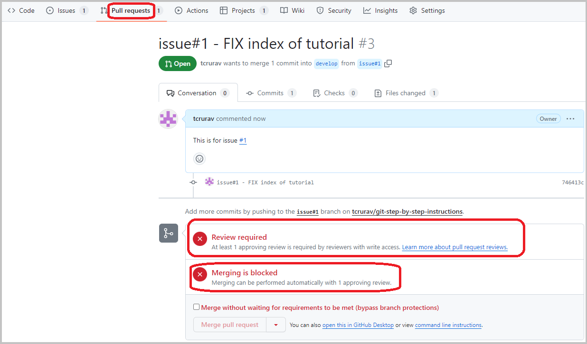

A different developer who works as reviewer should be the one who reviews the code clicking on the "add your review" button. Pay attention to reviewing from issue#1 to develop:

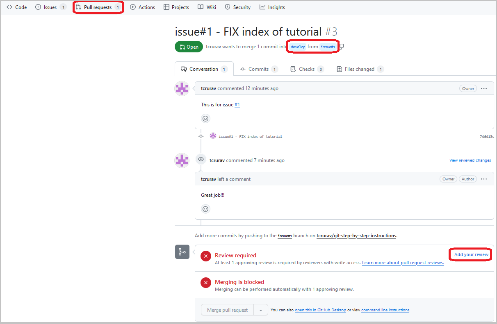

In the following window you can approve or request changes, and comment the code done in the issue:

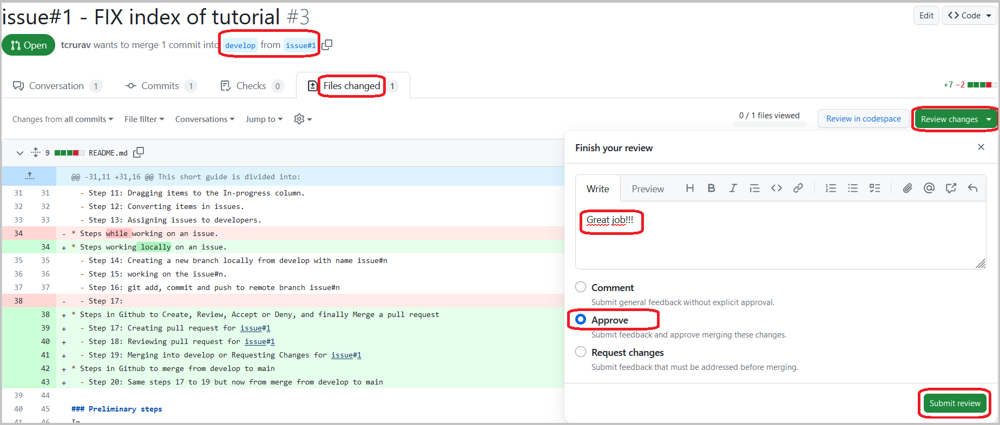


### Steps in Github to merge (Done)

* **Step 20: Merging into develop from issue#1**

Once you have, in previous step, submitted the review, you can now merge to develop from issue#1:

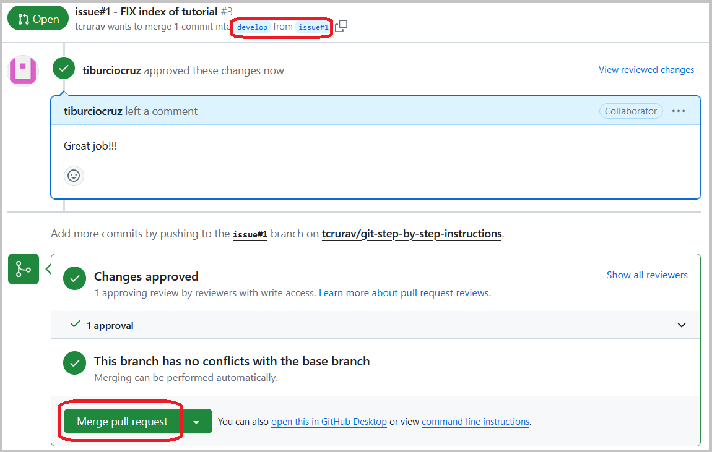


* **Step 21: Same steps 18 to 20 but now to merge from develop to main**

Whenever your team decides it you can merge from develop to main. For that you just need to repeat steps 18 to 20 just taking into account that now the reviewer is merging from develop to main.


## Built With

* [Visual Studio Code](https://code.visualstudio.com/) - The Editor used in this project.


## Acknowledgments

* https://gist.github.com/PurpleBooth/109311bb0361f32d87a2. A very complete template for README.md files.
* https://www.conventionalcommits.org/en/v1.0.0/. A specification for adding human and machine readable meaning to commit messages.
* https://nvie.com/posts/a-successful-git-branching-model/. A successful Git branching model.
